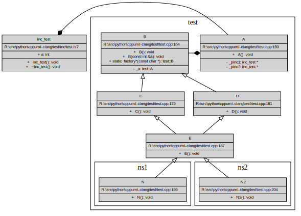

# cppuml-clang

Generate industrial scale UML SVG diagrams from C++ sources. Powered by clang. Driven by Python 3+

Currently runs on Linux (Ubuntu 20.04 being the reference platform) and Windows.

#### Installation:

Ubuntu:

1. `sudo apt update` (ensure latest builds are installed)
2. `sudo apt install graphviz rpm`
3. `sudo pip install libclang-dev`

Windows:

1. Get [graphviz/dot](https://www.graphviz.org/download/). Version 3.0+ is recommended. Ensure installation directory is on the path.
2. Get [clang](https://github.com/llvm/llvm-project/releases/tag/llvmorg-13.0.0). Ensure installation directory is on the path.
3. Check by running `clang-cl -v` and `dot -v` in a command window

Common to both:

4. `pip install pyinstaller clang libclang ccsyspath ` (python interfaces for clang and path discovery)
5. `git clone https://github.com/g40/cppuml-clang.git` (clone into a suitable root directory)
6. `cd cppuml-clang` (now ready to run)

#### Workflow:

1. If you like this toolset, then build a binary `make binary` and copy the resulting file in `./dist` to some folder for binaries that is in your path. You only need to do this once!
2. `cd <path/to/project>` into some folder that contains c++ files of interest. 
3. Run `cppuml --init`. This will initialize a skeleton configuration file (`<path/to/project>/cppuml.ini`)
4. Edit settings in `cppuml.ini`to suit local conditions. The defaults should be sensible.
5. Check paths to `clang` (`clang-cl` on Windows) and libclang. Adjust to suit. `cppuml` will sense-check these.
6. Now, inspired by make to an extent, you can just `cppuml` in `<path/to/project>`. 
The idea is to locate a project specific `.ini` file in relevant project root. This project specific `.ini` file can then be added to GIT as desired along with any generated assets (.dot and .svg files).

#### Quick test:

```bash

python ./src/main.py

>python main.py
R:\src\python\cppuml-clang\src\cppuml_clang.py:212 Queuing ['R:\\src\\python\\cppuml-clang\\test\\test.cpp']
R:\src\python\cppuml-clang\src\cppuml_clang.py:215 Parsing R:\src\python\cppuml-clang\test\test.cpp
R:\src\python\cppuml-clang\src\cppuml_clang.py:161 r:\apps\llvm\bin\clang-cl.EXE ['-x', 'c++', '-std=c++17', '-D_IS_WINDOWS', '-D_MBCS', '-Ir:/src/include', '-I.', '-I./test/inc', '-Ir:/src/audio/libaiff'] R:\src\python\cppuml-clang\test\test.cpp
R:\src\python\cppuml-clang\src\cppuml_clang.py:224 Generating dotfile R:\src\python\cppuml-clang\test/uml/test.cpp.dot : 8 class(es)
R:\src\python\cppuml-clang\src\cppuml_clang.py:235 Generated R:\src\python\cppuml-clang\test/uml/test.cpp.dot.svg

```

#### Result:

The auto-generated DOT and UML SVG files are, by default, located in `path/to/root/uml/<filename>.dot.svg` where <filename> is a matching source file name



#### Extras:

The  entire process can also be driven using a GNU compatible `make`

```
~/src/cppuml-clang$ make help
make run: run the example script
make binary: build an executable for your OS
make installer: build a distribution package for your OS
make clean: clean any junk. achtung baby.
```

#### Features:

1. Generates UML inheritance and association graphs directly from (valid) C++ code.
2. Respects and maps namespaces.
3. Optional filtering on the basis of filenames, i.e. `/usr/include`
4. Optional filtering on the basis of namespaces, i.e. `std`
5. Pass preprocessor definitions to clang e.g. `_IS_LINUX`
6. Pass C++ language standard to clang e.g. `c++11`
7. Allows project specific `.ini` files - the current working directory is always checked first.

#### Caveats:

This is an advanced work in progress, but with more to be done for:

- [ ]. Create smarter diagrams*. 
- [ ]. Improving SVG diagram styling (layout/colours/fonts etc.). 
- [ ]. OSX support is untested.
- [ ]. rpm creation fails with a weird 'file not found' error on Ubuntu Linux
- [ ]. There will be a bug or two. See 3.

* For example, including `std::` creates ~600 extra UML class records. Adding `memory` bumps this count to over 700. The resulting diagram is too large to be immediately useful.

#### Configuration:

The configuration file contains a number of options that are common and OS specific. 

`cppuml` checks for a `cppuml.ini` in the current working directory. If this does not exist it falls back to the copy shipped with the code. As is explained the default can also be overidden on the command line.

```
$ python main.py -h 

  C++ -> UML generator

          optional arguments:
          -h  get help!
          -i specify which `path/to/project.ini` if required. overrides search in current directory
          -s overrides the `directory` setting in the `.ini` file

          default is R:\src\python\cppuml-clang/cppuml.ini

```

The default example is below:

```
;
; boilerplate configuration file for c++ => UML generation
;

[common]
; default directory to scan, aka root!
directory=./test
;directory=.
; recursively search directoris
recursive=false
; types of files to search
filetypes=main.cpp,x.cpp,*.cpp,*.cc
; exclude specific files ...
exclusions=test2.cpp
; how much tracking info?
verbosity=1
; macroised output file location
outfile=$SRCDIR/uml/$SRCNAME.dot
; add named boxed in UML
generatenamespaces=true
; filter out any classes in thse C++ namespaces (CSV list)
excludenamespace=std
; this is a quick override for all filters. 
ignorefilters=false
; add links into UML records
generatehref=true

; all windows specific stuff hee
[win32]
; can be absolute or relative to root directory
include=r:\src\include,.\,./test/inc
excludefilepath=r:\vs2022,r:\vs2019,r:\vs2017,r:\vs2012,Windows Kits
clangstandard=c++17
clangdefines=_IS_WINDOWS,_MBCS
clangpath = 'clang-cl'
	
; all linux specific stuff
[linux]
include=../include,./test/inc
excludenamespace=std
excludefilepath=/usr/include,/usr/lib
clangstandard=c++17
clagdefines=_IS_LINUX
clangPath = '/usr/bin/clang++'
	
[darwin]
; N.B. untested as my Mac is in storage!
include=../include,./test/inc
excludenamespace=std
excludefilepath=/usr/include,/usr/lib
clangstandard=c++17
clagdefines=_IS_LINUX
clangPath = '/usr/bin/clang++'
```

#### A very large graph example:


#### Collaboration:

Comments, questions, and pull requests welcomed.

#### Credits:

Thank you https://github.com/sighingnow/libclang. Most excellent.
